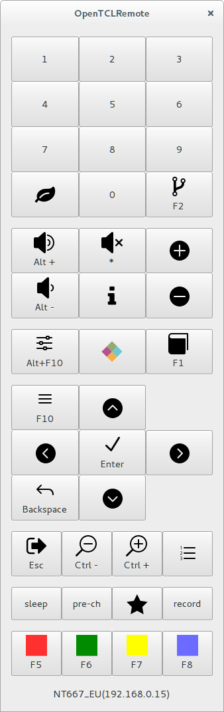

OpenTCLRemote
=============

OpenTCLRemote is a remote controller application written in Python 3 / GTK 3.

It simulates a remote controller for a TCL tv set by sending keys via the
local network.

License
-------

OpenTCLRemote is GPL-3 licensed.

Icons whose names starts with `arrow_` and `icon_` comes from the ElegantIcons
set .

Icons whose names starts with `awe_` comes from the Font Awesome icons set
.

Icons whose names starts with `zig_` were drawn by myself.

Requirements
------------

OpenTCLRemote requires:

- Python 3,
- GTK 3,
- a TCL tv set (only tested on a TCL S79 model) connected to your local network.

Usage
-----

OpenTCLRemote needs no arguments. Just run it!

It can be user with a mouse or with a keyboard (as long as the OpenTCLRemote
window has the focus). Supported keys are indicated on each remote controller
key.

Key functionalities
-------------------

- OpenTCLRemote uses the UPnP protocol to automatically find the IP address of
  the first compatible TV set.
- Connection is kept alive by regularly sending message (if the TV set does not
  receive a message after some time, it closes the connection).
- Only one instance can be run at the same time. If you try to execute it again,
  it simply gives the focus to the already existing instance.
- Keys from the keyboard are mapped on keys of the remote controller.

TODO
----

- write an installer
- better support for accessibility
- ...
